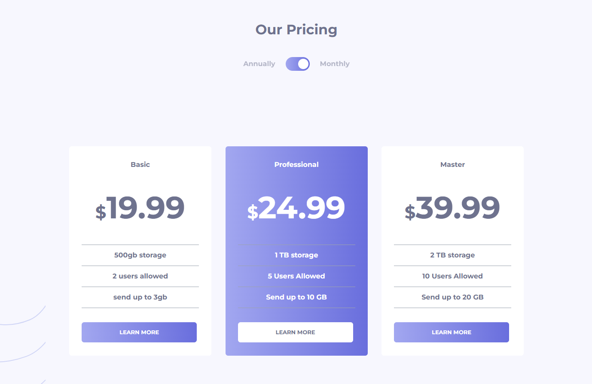

# Pricing Component Challenge - Completed

## Overview

Hi there, thank you for you checking out this project ❤️

The goal of this project was to create a visually appealing and functionally robust pricing component. To further enhance the development experience and the application's performance, I've employed a modern tech stack involving TypeScript, Next.js, React.js, and Tailwind CSS.



## Technologies Used

- **TypeScript**: Added strong typing to JavaScript, improving development and debugging.
  
- **Next.js**: Utilized for server-side rendering, improving the SEO and performance of the app.
  
- **React.js**: Employed for building the UI components in a maintainable and efficient way.

- **Tailwind CSS**: Used for rapid UI development without leaving the HTML.

## Features Implemented

### Toggle Control

- Users can control the toggle to switch between different pricing plans. This was implemented using React state management to ensure reactivity.

### Responsive Design

- The application is fully responsive, providing an optimized layout across various device screen sizes. Tailwind's utility-first CSS was particularly useful here.

### Interactive Elements

- All buttons, toggles, and other interactive elements have specified hover and focus states for better UX. Tailwind CSS classes were utilized to achieve this.

## Setup & Installation

1. Clone the repository

       ```bash
       git clone https://github.com/your-repository/pricing-component-challenge.git
       ```

2. Navigate to the project directory

       ```bash
       cd pricing-component-challenge
       ```

3. Install dependencies

       ```bash
       npm install
       ```

4. Run the project

       ```bash
       npm run dev
       ```

## Support

For any questions or support, feel free to reach out to me on LinkedIn: [Onias Filho](https://www.linkedin.com/in/oniasfilho). I'm more than happy to assist with any issues or questions you may have regarding this project.

Thank you for checking out this completed challenge! Feel free to dive into the code to better understand the implementation details.
